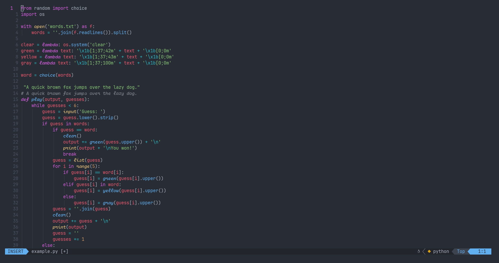

# JetFlow

A free, stylish font extending JetBrains Mono with cursive italics and nerd font glyphs.

## Usage
1. Clone this repository.
2. Go into the `fonts` directory or unzip `jetflow.zip`.
3. Install the fonts or move them into your system's font directory.
